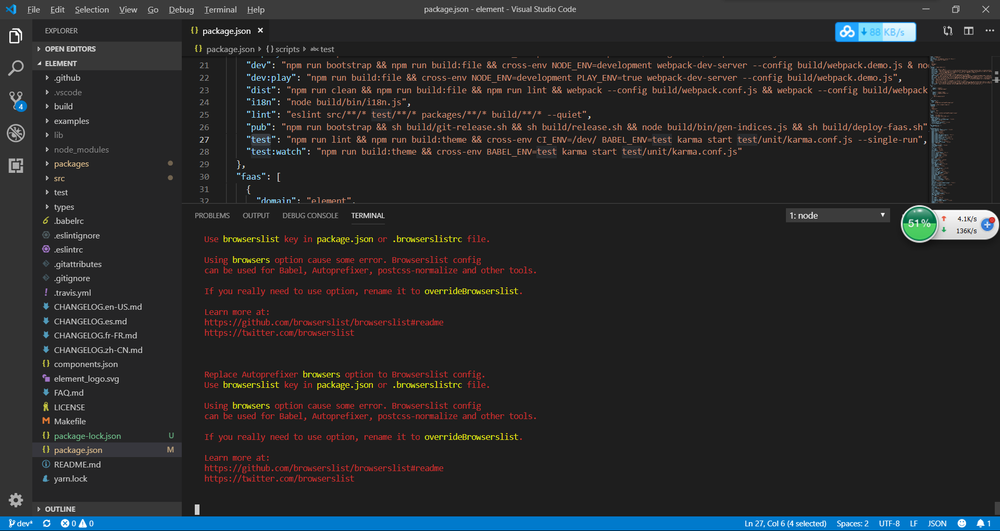
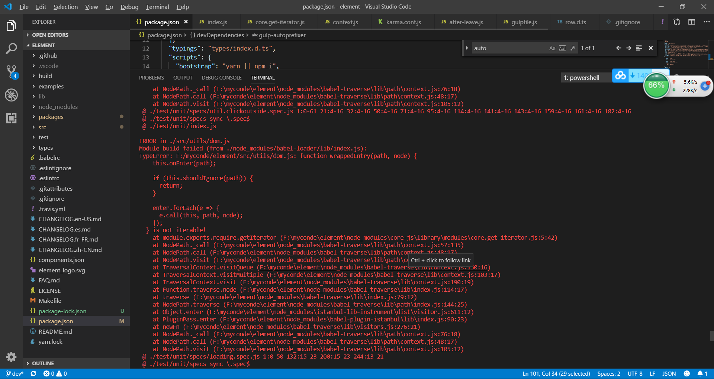

# 这个文件是 element 报错的总结

> 执行 npm run test

### 错误原因  
  browerlist 版本对应不上
  [https://blog.csdn.net/ljmkmnkl/article/details/91971682](https://blog.csdn.net/ljmkmnkl/article/details/91971682)
### 解决办法
  将 "gulp-autoprefixer": "^6.0.0" 替换为 "gulp-autoprefixer": "^5.0.0"

> 执行 npm run test

### 错误原因  
  是因为 重新 npm install 安装了找不到对应的依赖 
### 解决办法
  将所有的 node_modules 重新删除，还有将 package.json 重新下载下来