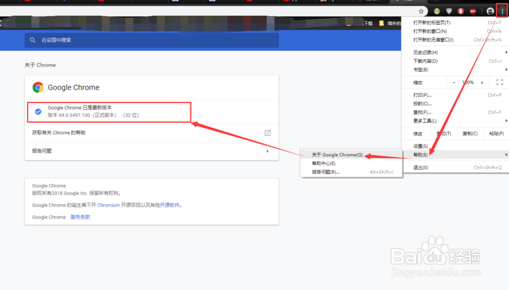
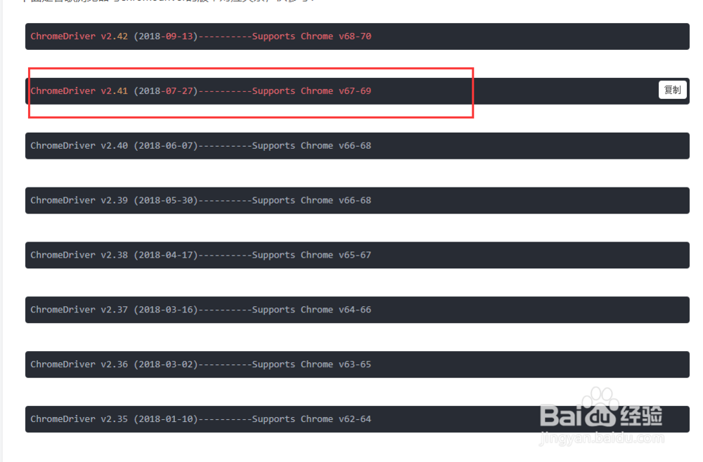
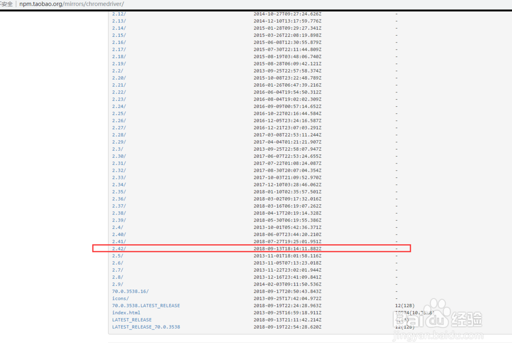
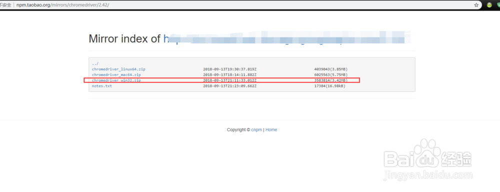
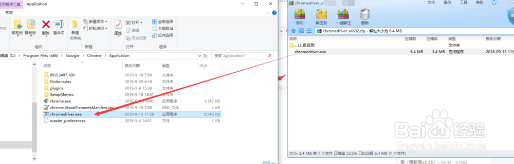
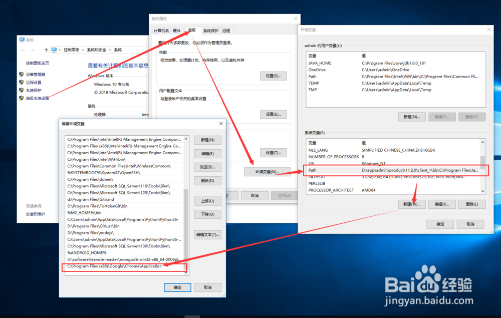

### [参考链接](https://jingyan.baidu.com/article/f7ff0bfcdd89ed2e27bb1379.html) (https://jingyan.baidu.com/article/f7ff0bfcdd89ed2e27bb1379.html)
### 如何快速下载、安装和配置chromedriver ？

1. 打开chrome浏览器，选择设置->帮助->关于chrome,查看自己浏览器的版本，如图所示  

2. 对照下图所示的Chrome版本与chromedriver兼容版表，找到适合自己版本的chromedriver  
[对应表链接](https://blog.csdn.net/huilan_same/article/details/51896672) https://blog.csdn.net/huilan_same/article/details/51896672

3. http://npm.taobao.org/mirrors/chromedriver/ 打开网站，找到适合自己的版本进行点击  

4. 步骤3后，进入到下图所示的界面，根据自己的需求，选择不同系统的版本进行下载  

5. 解压步骤4中下载压缩包，找到chromedriver.exe复制到chrome的安装目录

6. 可以复制步骤5中chromedriver.exe文件的路径并加入到电脑的环境变量中去，方便以后使用。  

