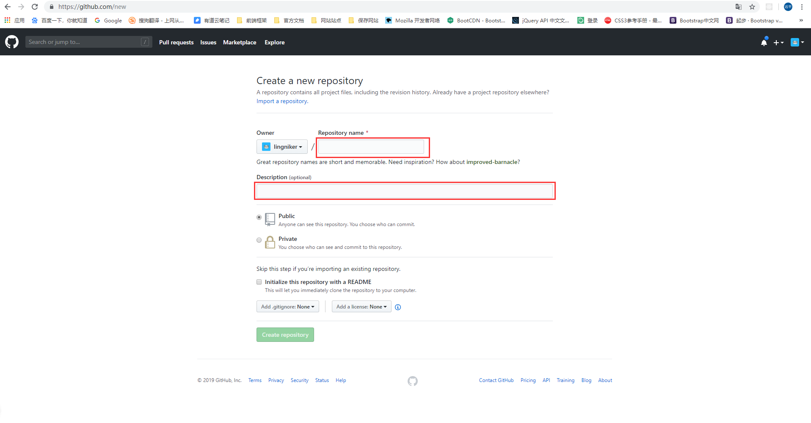
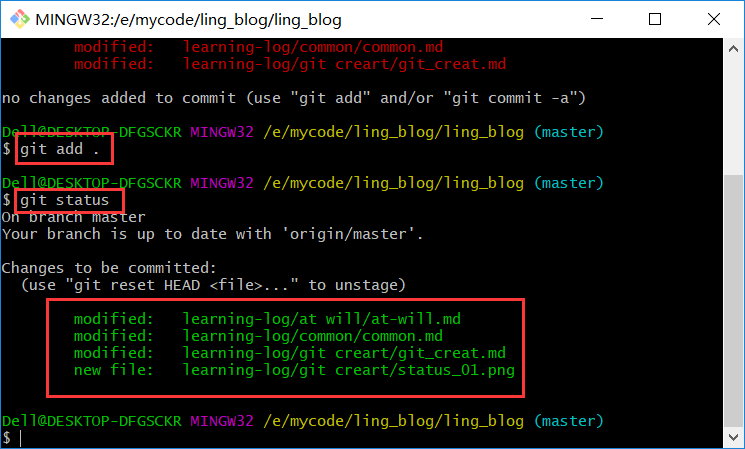

# 只是草稿 建议不要看

# git 学习 [git官网](https://github.com/)

1. 注册 登录 github (这没什么可说的)

2. 创建一个仓库 点击 new 

  

给仓库起一个名字,给个描述,是否是公开的,私人的需要付费。
  
   

## 创建了 github 之后，


// git 命令大全
// https://github.com/michaelliao/learngit/blob/master/2019-03/AlexSunShineZhou.md

// git config --system --unset credential.helper
// 参考链接 https://blog.csdn.net/ouyang_peng/article/details/80983996

// git 版本库是不是可已将多人带入进来。
// git fork 请求自己的路径
// git 使用的手册,是什么呢。
// 还有就是将其他人 拉近来有什么用呢。权限的控制。
// 版本的控制,主要的流程还会不知道啊.

```shell
   git clone https://github.com/lingniker/lixi.git //这里是你仓库的地址 将项目下载到本地里 
   cd lixi // 进入到你的仓库中
   git status // 查看库的状态
   git add . // 将所有的修改 条件到暂存区里
   git commit -m 'commit' // 将库由暂存区 提交到本地主干上
   git push // 将库提交到线上
   git check // 切换分支本地没有分支。若果是公开的仓库的话没有必要去创建分支，分支自有你自己知道。
   git merge // 合并分支
   git checkout // 切换分支
   git reset // 版本的回退
   git revert // 版本的回退
   git log // 提交的日记
```

```js
   git init file  // 初始化一个仓库 
```

```js
  git config --global user.name 'lingniker' // 谁是这的库 拥有着
  git config --global user.mail 'lingyuanping@outlook.com' // 你的邮箱
```

```js
  git status // 查看暂存区 暂存区有三个转态。文件未添加,文件添加中，文件未添加, 如下图一所示 
  git add .  // 将所有的文件添加到暂存区中 文件进入padding 转态 如图二 所示
  git commit -m 'update' // 将暂存架上的添加到库中， 每次commit,都会生成 一个 哈希。 -m 'update' 是描述 这次的提交。方便日后查看的时候干了什么。提交完成之后就回退的了第一个转态，未改变转态
  
```



> 图三 所示 就是将 项目提交上来了,没有任何的提交的东西。


```js
   　git checkout -- <filename> //文件修改后还没有提交到暂存区，进行撤销操作之后，文件恢复到和版本库中一模一样
　　 git reset HEAD -- <filename>//文件修改后提交到了暂存区，进行撤销之后，文件恢复到在提交到暂存区之前的状态
```
[参考](https://www.jb51.net/article/104685.htm)

## 与线上同步
```js
  git clone // 将线上的代码clone到本地 将是自己git项目, 这样才能提交。
  git remote \<origin\> \<giturl\> // 设置源文件
  git pull // 从远程仓库下载下来文件
  git push // 提交到远程仓库中
```

## 远程仓库 同一仓库授权 添加管理者信息 // 将其他人提交到版本库的管理上 其他人就有了这个版本库的权限了
```js
  // 测试另一个用户提交
```

> 分支的创建,切换
```js
  git branch branchname    // 创建分支
  git checkout  branchname  // 切换分支
  git mergn // 合并分支
  // 测试插入
```

> 请求远程的分支 dev 
```js
   git pull origin master/dev // 请求远程的分支
```

### lixi 的步骤
``` js
    git clone  `https://lingniker/github.com/lixi.git` // 克隆 lixi 仓库
    git branch dev // 创建分支
    git checkout dev // 切换分支
    git pull origin master/dev // 将远程的dev分支上下载下来 先将现在master的文件全部删除掉
    git push origin dev // 提交到 远程的 dev 上
    // 这样本地就有了 dev 和 master 了。以后就可以使用 dev 做开发了。master 只是发版。不做任何开发。
    // 任何人都是使用的是dev上代码。获取的都是最新的代码。
    // 多人开发。所有的人的开发都是提交到dev上。更新的版本也是在dev上。
    // 先fork 下。然后就是 pullrequest dev 上的代码。
    // 然后就是提叫代码。等待 管理员的合并。
    // master 不做任何开发的用途. 
    // tag 分支
    // gh-pages 是展示项目用的
```

ling_website 
```js
    git remote add origin 'https://github.com/lingniker/ling_website.git' // 设置源
    // 使用的 vue 做开发
```

> 查看日记
git log --pretty=oneline .\README.md
git show <版本> <文件名>

> 查看提交的代码量 
git log --author="lingniker" --pretty=tformat: --numstat | awk '{ add += $1; subs += $2; loc += $1 - $2 } END { printf "added lines: %s, removed lines: %s, total lines: %s\n", add, subs, loc }'
