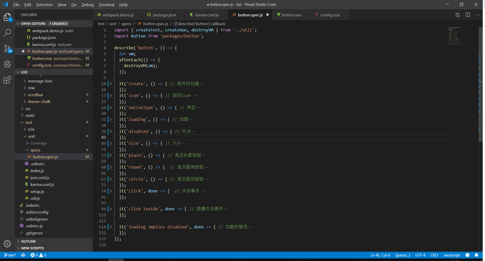

## 这是一个框架， 基于 vue 的一个前端 ui 框架。
### 其实就是 抄 element ui 上。本想结合 muse-ui 。但是我已经没有精力去解读 muse - ui了。

### 从 element 中学习了。 eslint,wenpack,webpack-dev-seaver,postcss,makerdowm,babel,i18n,thement.
1. karma 单元测试
2. git 分支的建立，多人开发流程，版本管理。
3. npm 包的发布。 项目的整体流程。 
4. npm 很多有用的包。
5. 使用脚手架,创建。 render 的正真思想。
6. sass 的高级的使用。
8. 看我如何将它吃下去。
9. bem命名规则。
10. 你想说什么。
11. 测试，是与需求无关的。


记录下处在的 bug。 这里npm install 第二遍之后就会报错。webpack 与 guil 共同的使用。Coverage summary 

chromedriver 安装


#### 简单介绍下。这个项目的目录结构
1. build 创建目录
2. exprotement 
3. 覆盖率的操作 

### 接下来以 button 这个组件进行将接

> 先看单元测试下有什么



> `组件的创建`,`测试icon`,`类型`,`加载`,`可点`,`大小`,`是否朴素按钮`,`是否圆角按钮`,`是否圆形按钮`,`点击事件`,`插槽点击事件`,`加载时禁用`
> 对按钮做了这些的单元测试。
> 有了这些的单元的测试就能确保能用

```html
<template>
  <button
    class="lx-button"
    @click="handleClick"
    :disabled="buttonDisabled || loading"
    :autofocus="autofocus"
    :type="nativeType"
    :class="[
      type ? 'lx-button--' + type : '',
      buttonSize ? 'lx-button--' + buttonSize : '',
      {
        'is-disabled': buttonDisabled,
        'is-loading': loading,
        'is-plain': plain,
        'is-round': round,
        'is-circle': circle
      }
    ]"
  >
    <i class="el-icon-loading" v-if="loading"></i>
    <i :class="icon" v-if="icon && !loading"></i>
    <span v-if="$slots.default"><slot></slot></span>
  </button>
</template>
<script>
  export default {
    name: 'LxButton',

    inject: {
      elForm: {
        default: ''
      },
      elFormItem: {
        default: ''
      }
    },

    props: {
      type: {
        type: String,
        default: 'default'
      },
      size: String,
      icon: {
        type: String,
        default: ''
      },
      nativeType: {
        type: String,
        default: 'button'
      },
      loading: Boolean,
      disabled: Boolean,
      plain: Boolean,
      autofocus: Boolean,
      round: Boolean,
      circle: Boolean
    },

    computed: {
      _elFormItemSize() {
        return (this.elFormItem || {}).elFormItemSize;
      },
      buttonSize() {
        return this.size || this._elFormItemSize || (this.$ELEMENT || {}).size;
      },
      buttonDisabled() {
        return this.disabled || (this.elForm || {}).disabled;
      }
    },

    methods: {
      handleClick(evt) {
        this.$emit('click', evt);
      }
    }
  };
</script>
```

1. packjson 的 分析

打包整个 dist。 开发环境 dev。  打包成文档 web。 测试 test。

webpack.common.js 共同
webpack.component.js 组件
webpack.conf.js 配置
webpack.dome.js 示例
webpack.extension.js 扩展
webpack.test.js 测试