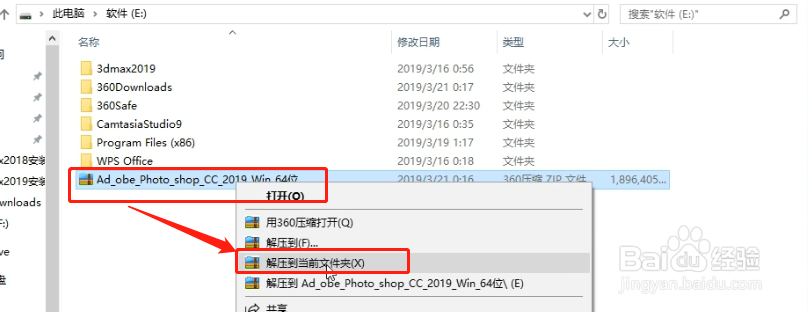
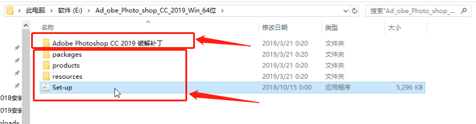
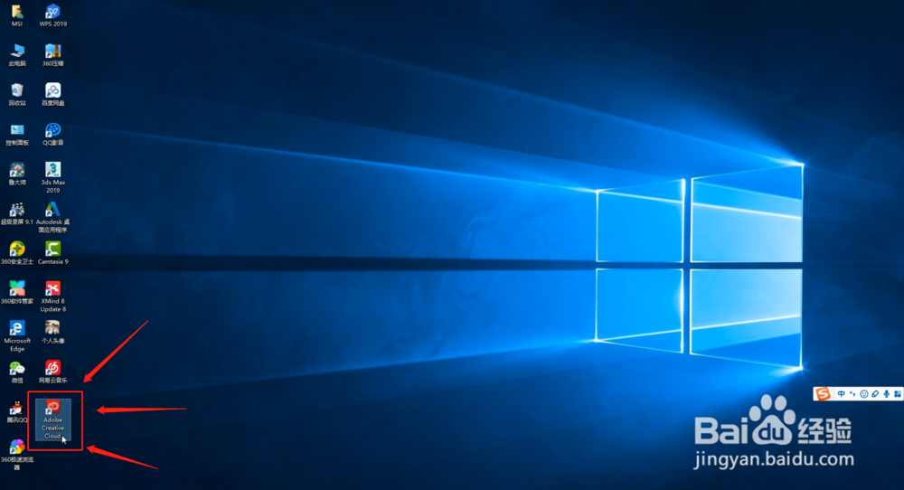
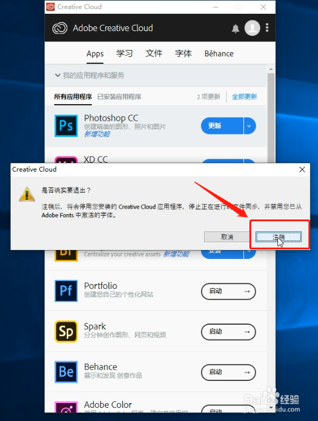

# ps 2019 安装教程

## 1.【PSCC2019软件下载链接：https://pan.baidu.com/s/1SvjWpxHs61cqSmh4FV_61w 提取码：urp5】

## 2. 根据上方的下载地址下载好PSCC2019是一个压缩包，文件较大，建议你可以放在磁盘空间剩余较多的PS文件夹中；然后右键单击，选择解压到当前文件夹；‘

## 3. 解压出来之后的文件夹会包含两类文件，一个是正常的软件安装程序，一个是专门用于PSCC2019的PJ文件；

## 4. 我们先安装PSCC2019的软件，双击安装程序Setup；

## 5. 打开之后，需要你输入自己的AdobeID，如果你之前有的话，直接输入即可，如果没有可以点击下面的获取AdobeID自己申请一个即可；

## 6. 输入之后按回车Enter，自动进入安装程序，这个过程有点长，大概需要10分钟左右的时间，耐心等待即可；

## 7. 自动安装程序进度完成之后，程序会自动启动PSCC2019的软件，进入启动程序；

## 8. 启动打开之后PSCC2019就是这样的界面，可以说目前已经安装成功，只不过是属于试用版本，右上方会显示还可以试用7天；（我的显示还可以试用4天是因为我前两天安装了一遍，为了给你分享，自己又卸载重新安装

## 9. 现在进入破解程序，在开始破解之前的第一步是需要先注销Adobe账号，双击打开电脑桌面的Adobe Creative Cloud图标；

## 10. 打开后点击右上方的头像会显示你的AdobeID，上面有一个注销选项，点击注销；

## 11. 此时会出现一个提示对话框，提示你是否要退出，直接点击注销即可，然后关闭这个界面；

## 12. 现在回到解压的PSCC2019文件夹，找到PSCC2019破解文件的文件夹，双击进入；

## 13. 进入之后，里面会有一个文件，这个就是PSCC2019的专属破解文件；

## 14. 现在要找到PSCC2019的安装根目录，找的方法很简单，点击电脑左下方开始，在所有程序内找到刚安装的Adobe PhotoshopCC2019，右键单击，选择更多，再选打开文件位置，单击打开；

## 15. 此时会出现一个PSCC2019快捷方式所在的文件夹，这里还不是根目录，右键单击PSCC2019，选择属性；

## 16. 在PSCC2019的属性内，选择快捷方式，再点击下方的打开文件所在位置；

## 17. 此时会打开一个文件夹，这里就是PSCC2019的根目录了，可以看到里面有Photoshop以及安装的其他所有程序文件；

## 18. 现在在PSCC2019的破解文件夹内找到破解文件，右键单击选择复制；

## 19. 打开PS的根目录文件夹，右键点击，选择粘贴PSCC2019破解文件；

## 20. 此时会跳出一个对话框，提示你是替换还是跳过，选择第一个替换目标中的文件；

## 21. 好了，此时你电脑上的PSCC2019软件已经破解成功，在开始程序内找到你的PSCC2019软件，点击打开就是下图的界面，此时你可以看到，右上方的试用提示已经没有了，说明你的软件已经破解成功，可以永久使用。恭喜你！

