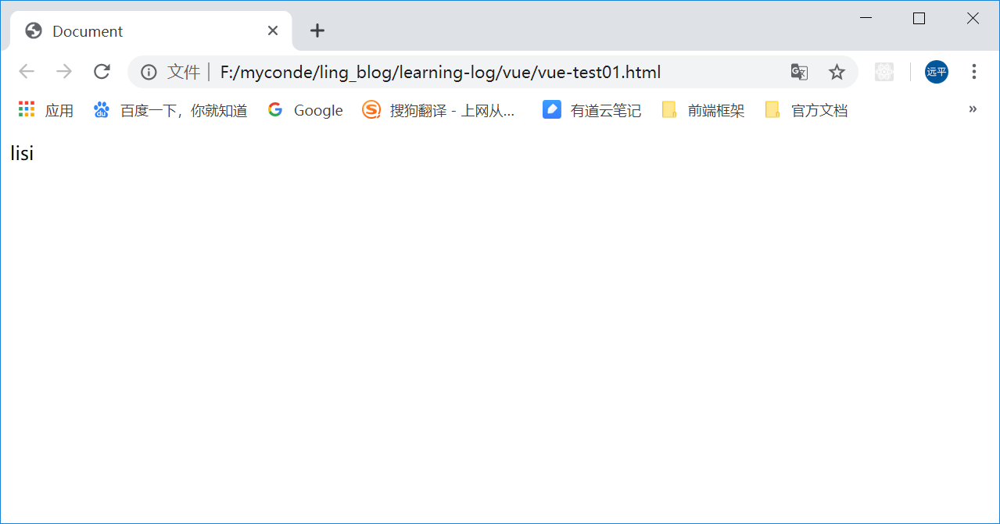
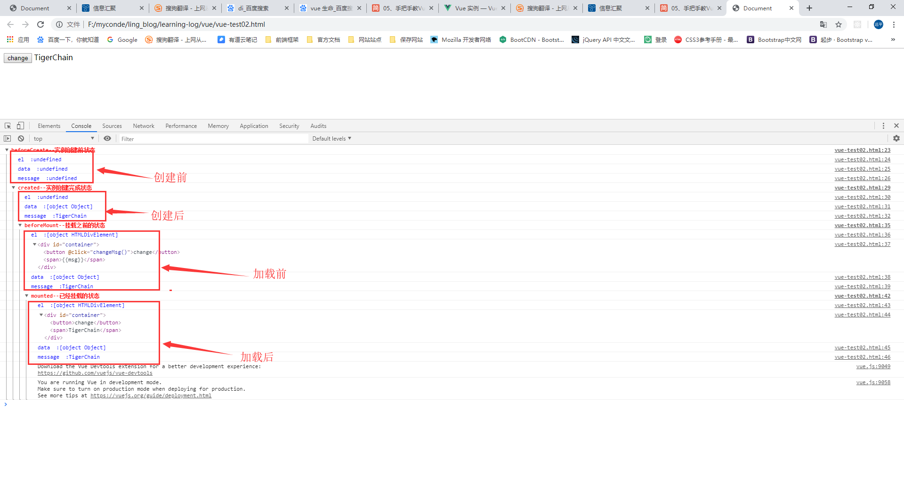
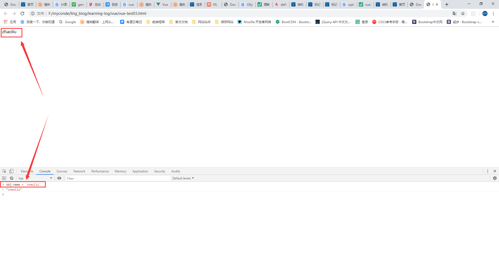

# 解读的是 2.6.10 版本的 vue 
## 代码参考 node_modules/vue/dist/vue.js


### 本次主要所讲的内容是 1.生命周期, 2.虚拟dom, 3.diff 算法, 4.指令(主要将的是 v-for), 5.render 函数, 6.watch
### vue 上代码

```html
  <!DOCTYPE html>
  <html lang="en">
  <head>
    <meta charset="UTF-8">
    <meta name="viewport" content="width=device-width, initial-scale=1.0">
    <meta http-equiv="X-UA-Compatible" content="ie=edge">
    <style>*{margin:0px;padding:0px;}</style>
  </head>
  <body>
    <div id="app">{{ name }}</div>
  </body>
  <!-- 引用的是互联网的vue -->
  <script src="https://cdn.bootcss.com/vue/2.6.10/vue.min.js"></script>
  <script>
    var vue = new Vue({
      el: '#app',
      data: {
        name: 'lisi'
      }
    })
  </script>
  </html>
```

### 上面个的代码  vue 做了什么
1. 将 
    {
      el: '#app',
      data: {name: 'lisi'}
    } 
传了进去
2. 在 vue 源码里面 有一个构造函数
```js
  function Vue(options) {
    // 一切的开始 都源于这个函数
    // 这个函数中有一个 init 的方法 源码中什么都没有
    this._init(options);
  }
```
1. 接下来就是执行函数初始化函数 
2. initMixin(Vue) // 将Vue 函数传进出。主要是将 Vue 添加 _init 的方法
3. stateMixin(Vue); // 设置状态
4. eventsMixin(Vue); // 事件的绑定
5. lifecycleMixin(Vue); // 初始化生命周期。 vue 的生命周器就是重这里设置的。 vue 有8个周期,
beforeCreate created
```js
  // 生命钩子是怎样调用的呢
  // 会触发两个生命周期 beforeCreate
  // 代码是这样的
  new Vue({
    el:'#app',
    data: {name: 'lisi'},
    beforeCreate: function() {
      console.log('执行 beforeCreate')
    },
    created: function() {
      console.log('执行 created')
    }
  })
  // 当执行 vue 的时候会执行两个函数呢 [有关生命周期的链接]
  // vue 中有这样的一个函数 callHook 主要是出发钩子函数的。
  // 实例化代码传进 beforeCreate created 函数时。就会在对应时刻代码触发
  // 数据的监听 observe() 函数,是将 $option 传进去的 进行监听
  // 做了代理 proxy 将数据进行了代理  vm.data.name 简化为 vm.name 
  // 在 Object.defineProperty(obj,key,sharedPropertyDefinition) 将数据进行监听
  // 讲下 Object.defineProperty 的属性
  var obj = { one: 12}
  Object.defineProperty(obj,['one'],{
    get(){
      console.log('get')
    },
    set(newVal) {
      console.log('set', newVal)
    }
  })
  obj.one; // get
  obj.one = 123; // set 123
  // 就能对$option 的值进行监听了。当改变值时。 这就是 vue 的基本核心思想了。
```
1. 接下来是 render 函数了。render 函数是怎样的一个函数呢。
2. 现在还是 页面上的指令还是 不能解析。
3. div 上的 v-for 又是一个怎样的处理呢。接下来进行分析。
4. vue 会生成一个解析指令的函数。render 是解析指令的函数。
5. 在初始化的时候。对 $option 进行了赋值。给选项添加 render 函数
6. 创建函数 parse 将 template 与 option 传进去生成一颗抽象树
7. 抽象树创建完成了之后呢。又有什么事情发生呢。我不知道会有什么事情发什么。
8. 抽象树创建出来。就使用 render 函数。render 函数干了什么。
9. render 函数将 抽象树 

10. 记住最重要的一点就是。到最后才会使用  __path__ 这个函数将 所用的东西更新到 界面上。
11. 记住，在界面上添加一个元素的方法是 insertNode addChilds innerHTML 

```js
  var nodeOps = { // 这就是节点的 所有操作方法  无论这样都会调用这些方法的
    createElement: createElement$1,  // 创建节点
    createElementNS: createElementNS, // 创建节点
    createTextNode: createTextNode, // 创建 文字节点
    createComment: createComment,  /// 创建 共同 ？？ (我也不知道)
    insertBefore: insertBefore, // 插入节点
    removeChild: removeChild,  // 移除节点
    appendChild: appendChild,  // 添加节点
    parentNode: parentNode,    // 父节点
    nextSibling: nextSibling,   // 下一个节点
    tagName: tagName,  // 改变标签名
    setTextContent: setTextContent, // 设置文本内容
    setStyleScope: setStyleScope  // 设置样式
  }
```

12. 根据页面生成一颗抽象树。render 调用 render 的时候就能更新试图了。
数据触发的时候就。更改render 函数。生成一个 虚拟的 dom。虚拟 dom 会做 patch 比较。使用diff算法。最终更新到页面上。


13. 只是做了 diff 算法。
```js
  // 通俗易懂的说是, 就是判断节点那些改变。
  // 说一个非常好的测试。
```
//学习了，匿名函数的调用。

// 这样就完成了。是不是学到了很多啊。

```js
   // 抽象树长什么样啊。
   `<div>123</div>`
```

// 还是重新整理一下吧。别说了。我自己都不明白说的是什么。是将 vue 跑通了。但是这样还是不行啊。
// 说的是什么鬼啊。看到这句话。你是聪明的。上面的所有的东西只是帮助作者理解的。接下来才是真的解析。


## vue 是如何工作的
### 本文使用的源码是 Vue.js v2.6.10 可自行从官网下载,或者是本项目的中获取。
### 文档带注解的 vue vue-annotation.js。  本项目的中获取
1. 首先我们知道 vue 是这样使用的
```html
   <div class="app">{{ name }}</div>
   <script src="vue.js"></script>
   <script>
   new Vue({
     el: '#app',
     data: {
       name: 'lisi'
     }
   })
   </script>
   <!-- 这是一个最简单的例子  页面会呈现lisi -->
   
```
> 对应的文件是 vue-test01.html


2. 为什么页面会呈现 lisi 呢。 vue 做了什么。这就是本文 所讨论的问题之一。
3. 首先, vue 源码中。(不要从头往下看)

```js
  function Vue (options) { // vue.js 5067行。 一切都是从这里开始。 options 就是我们传进的参数
    // ···
    this._init(options); // 初始化整个 vue。 参数为传进的参数
  }
  // vue 不只是一个这么简单的函数
```

4. 接下来给 vue 添加属性和方法
```js
  // vue.js 5075行
  initMixin(Vue); // 给 Vue 添加 init 函数
  stateMixin(Vue); // 给 Vue 设置状态
  eventsMixin(Vue); // 给 Vue 设置事件
  lifecycleMixin(Vue); // 给 Vue 设置生命周期
  renderMixin(Vue);  // 给 Vue 添加 render 函数
```
5. 生命周期(先别看) [参考链接](https://www.jianshu.com/p/0d50ea1cef93?utm_source=oschina-app) https://www.jianshu.com/p/0d50ea1cef93?utm_source=oschina-app

```html
  <!-- 读书人的事情怎么算是偷呢,感谢博主提供的代码 -->
  <div id="container">
    <button @click="changeMsg()">change</button>
    <span>{{msg}}</span>
    <button @click="destroy()">destroy</button>
  </div>

  <script type="text/javascript">
    var vm = new Vue({
      el:'#container',
      data:{
        msg:'TigerChain'
      },
      beforeCreate(){
        console.group("%c%s","color:red",'beforeCreate--实例创建前状态')
        console.log("%c%s","color:blue","el  :"+this.$el)
        console.log("%c%s","color:blue","data  :"+this.$data)
        console.log("%c%s","color:blue","message  :"+this.msg)
      },
      created() {
        console.group("%c%s","color:red",'created--实例创建完成状态')
        console.log("%c%s","color:blue","el  :"+this.$el)
        console.log("%c%s","color:blue","data  :"+this.$data)
        console.log("%c%s","color:blue","message  :"+this.msg)
      },
      beforeMount() {
        console.group("%c%s","color:red",'beforeMount--挂载之前的状态')
        console.log("%c%s","color:blue","el  :"+this.$el)
        console.log(this.$el);
        console.log("%c%s","color:blue","data  :"+this.$data)
        console.log("%c%s","color:blue","message  :"+this.msg)
      },
      mounted() {
        console.group("%c%s","color:red",'mounted--已经挂载的状态')
        console.log("%c%s","color:blue","el  :"+this.$el)
        console.log(this.$el);
        console.log("%c%s","color:blue","data  :"+this.$data)
        console.log("%c%s","color:blue","message  :"+this.msg)
      },
      beforeUpdate(){
        console.group("%c%s","color:red",'beforeUpdate--数据更新前的状态')
        console.log("%c%s","color:blue","el  :"+this.$el.innerHTML)
        console.log(this.$el);
        console.log("%c%s","color:blue","data  :"+this.$data)
        console.log("%c%s","color:blue","message  :"+this.msg)
        console.log("%c%s","color:green","真实的 DOM 结构:"+document.getElementById('container').innerHTML)
      },
      updated() {
        console.group("%c%s","color:red",'updated--数据更新完成时状态')
        console.log("%c%s","color:blue","el  :"+this.$el.innerHTML)
        console.log(this.$el);
        console.log("%c%s","color:blue","data  :"+this.$data)
        console.log("%c%s","color:blue","message  :"+this.msg)
        console.log("%c%s","color:green","真实的 DOM 结构:"+document.getElementById('container').innerHTML)
      },
      activated() {
        console.group("%c%s","color:red",'activated-- keep-alive 组件激活时调用')
        console.log("%c%s","color:blue","el  :"+this.$el)
        console.log(this.$el);
        console.log("%c%s","color:blue","data  :"+this.$data)
        console.log("%c%s","color:blue","message  :"+this.msg)
      },
      deactivated(){
        console.group("%c%s","color:red",'deactivated-- keep-alive 停用时调用')
        console.log("%c%s","color:blue","el  :"+this.$el)
        console.log(this.$el);
        console.log("%c%s","color:blue","data  :"+this.$data)
        console.log("%c%s","color:blue","message  :"+this.msg)
      },
      beforeDestroy() {
        console.group("%c%s","color:red",'beforeDestroy-- vue实例销毁前的状态')
        console.log("%c%s","color:blue","el  :"+this.$el)
        console.log(this.$el);
        console.log("%c%s","color:blue","data  :"+this.$data)
        console.log("%c%s","color:blue","message  :"+this.msg)
      },
      destroyed() {
        console.group("%c%s","color:red",'destroyed-- vue实例销毁完成时调用')
        console.log("%c%s","color:blue","el  :"+this.$el)
        console.log(this.$el);
        console.log("%c%s","color:blue","data  :"+this.$data)
        console.log("%c%s","color:blue","message  :"+this.msg)
      },
      methods: {
        changeMsg() {
          this.msg = 'TigerChain111'
        },
        destroy() {
          this.$destroy() 
        }
      }
    })
  </script>
```

> 运行的结果  


6. 现在主要说的是生命周期中的 beforeCreate 和 created 
在 `initMixin(Vue)` 中添加了一个 `Vue.prototype._init`  增加了一个函数
[参考](https://segmentfault.com/a/1190000007087912) https://segmentfault.com/a/1190000007087912

```js 
  // vue 4989行。  
  initLifecycle(vm); // 初始化生命周期
  initEvents(vm);    // 初始化事件
  initRender(vm);    //  初始化 渲染函数
  callHook(vm, 'beforeCreate'); // 调用生命周期的创建前钩子
  initInjections(vm); // resolve injections before data/props // 初始化注册事件
  initState(vm);  // 初始化状态事件 
  initProvide(vm); // resolve provide after data/props  // 初始化规定
  callHook(vm, 'created'); // 调用生命周期的创建后钩子
```

> 这里主要说的是调用钩子函数

```js
  // 回顾下vue 代码
  var vm = new Vue({
    el:'#container',
    data:{
      msg:'TigerChain'
    },
    beforeCreate(){ // 在这里我们传入 beforeCreate
      console.group("%c%s","color:red",'beforeCreate--实例创建前状态')
      console.log("%c%s","color:blue","el  :"+this.$el)
      console.log("%c%s","color:blue","data  :"+this.$data)
      console.log("%c%s","color:blue","message  :"+this.msg)
    },
    created() { // 在这里我们传入 beforeCreate
      console.group("%c%s","color:red",'created--实例创建完成状态')
      console.log("%c%s","color:blue","el  :"+this.$el)
      console.log("%c%s","color:blue","data  :"+this.$data)
      console.log("%c%s","color:blue","message  :"+this.msg)
    },
  })
```

> vue 会在不同的时刻调用钩子函数,并触发对应的钩子函数。 
> callHook(vm, 'beforeCreate'); 这是的 vue 对应的 el data msg 都没有被赋值 所以说界面 没有值
> 接下来分别 执行下面三个函数。
> 1. initInjections(vm); // resolve injections before data/props // 初始化注册事件
> 2. initState(vm);  // 初始化状态事件 
> 3. initProvide(vm); // resolve provide after data/props  // 初始化规定
> `callHook(vm, 'created');` 这是的 vue 对应的 el 没有赋值 ;  data msg 被赋值;  调用钩子函数 触发界面上的 created 函数


7. 这里说下 initState(). 应该有很多人都知道 vue 之所以是双向数据绑定.是因为 Object.defineProperty 这个属性。(后面自己看,看我的)
[参考](https://segmentfault.com/a/1190000007434923) https://segmentfault.com/a/1190000007434923

```html
  <div id='app'>wangwu</div>
  <script>  
    var obj = {
      name: 'lisi'
    }
    Object.defineProperty(obj, 'name' {
      get: function(){
        console.log('获取对象的值')
      },
      set: function (newVal){
        document.getElementById('app').innerText = newVal
      }
    })
    obj.name = 'lisi'
  </script>
```
> 在页面上输入 `obj.name = 'zhaoliu'`  界面也会变动。改变数据就能改变界面。
现在实现的单向流动。这就是 `Object.difineProperty` 的基本使用。



8. 接下来调用的是 $mount 函数

9. 什么是虚拟 dom
```js
```

10. 最痛苦的是 抽象树。还有就是如何将这些东西转化过来。使用框架的目的是什么。提升开发效率。专业化。